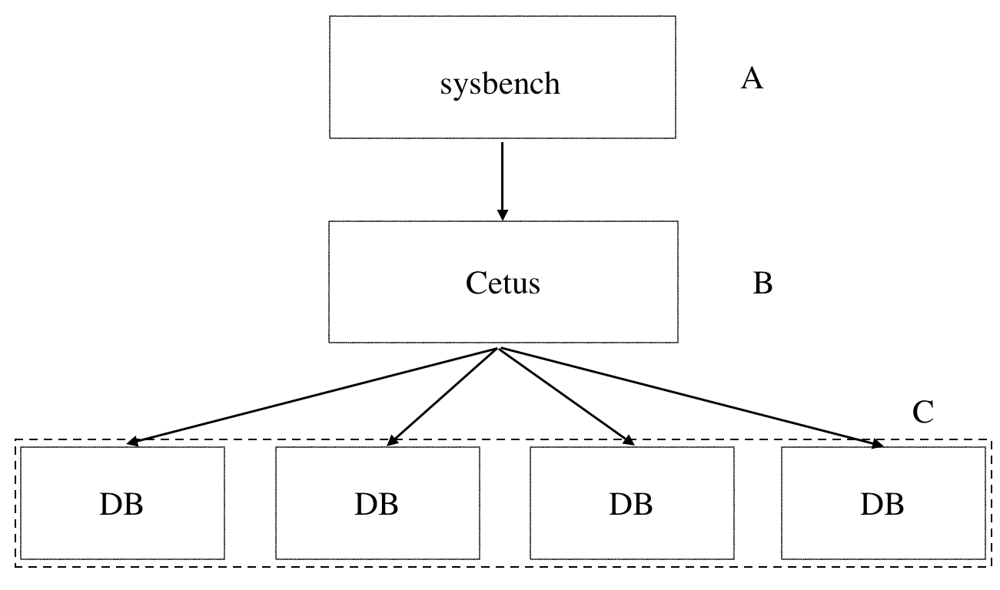
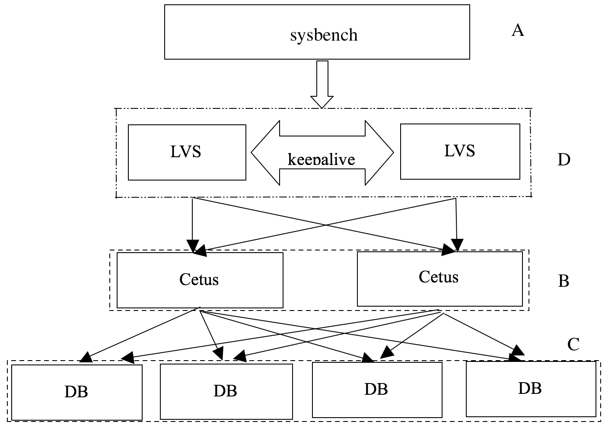

# Cetus 测试报告

##  简介

Cetus 测试报告包括Cetus性能测试和Cetus健壮性测试，其中Cetus性能测试主要是单Cetus、集群部署Cetus与原生mysql的性能对比情况，Cetus健壮性测试主要是在持续发业务冲击、前后端网络闪断和Cetus切换等场景中测试软件的性能。

## 测试环境

### 硬件环境

|  类别  |                    名称                    |
| :--: | :--------------------------------------: |
| CPU  | Lenovo R520 \* 3 Intel Xeon 5130 @ 2.0GHz \* 2(4 cpu core at all) |
| DISK |      4G DDR2 667 \* 2(Dual Channel)      |
| RAM  |               1T 7.2k sata               |

|  类别  |                    名称                    |
| :--: | :--------------------------------------: |
| CPU  | Dell 2950 * 1 Intel Xeon 5405 @ 2.0GHz * 2(8 cpu core at all) |
| DISK |      4G DDR2 667 \* 4(Dual Channel)      |
| RAM  |        400G 10k sas * 2 (raid 1)         |

### 网络环境

|     业务类别     |    服务器类型    |     服务器OS     |
| :----------: | :---------: | :-----------: |
| LVS/sysbench | Lenovo R520 | Ubuntu14.04.1 |
|    Cetus     | Lenovo R520 |    RHEL6.5    |
|    MySQL     |  Dell 2950  |    RHEL7.2    |

### 软件环境

|    软件    |          版本           |              备注               |
| :------: | :-------------------: | :---------------------------: |
| sysbench |          1.0          |  特定读写分离版本和分库版本测试lua脚本，新增部分参数  |
|   LVS    |        1.2.13         | 使用的NAT方式,使得一个机器上不同端口部署多个Cetus |
|  MySQL   |        5.6.31         |         测试环境用仓库rpm安装          |
|  Cetus   | 9d14b568(tcpstream分支) |          2018年1月2日版本          |

## 测试准备

利用上述配置搭建了Cetus测试环境，服务器A运行sysbench(10.238.7.7)，服务器B运行Cetus(10.238.7.9)，服务器C运行数据库(读写分离版10.238.7.10／sharding版10.238.7.12、10.238.7.13)，服务器D运行LVS(10.238.7.8)，四台服务器处在同一个网段中。

单Cetus拓扑如下：



集群Cetus拓扑如下：



## 测试过程

### 性能测试

我们主要考虑测试软件在各个线程情况下的工作性能，性能指标主要包括每秒事务数、每秒请求数、平均响应时间以及95%请求成功响应的响应时间。

测试数据库我们是使用sysbench自己创建的对应测试库。建库的语句如下：

```
  /home/liuyanlei/sysbench_install/bin/sysbench --test=/home/liuyanlei/sysbench_install/share/sysbench/tests/include/oltp_legacy/oltp.lua \
  --mysql-table-engine=innodb \
  --mysql-host=192.168.192.1 \
  --mysql-port=3440 \
  --mysql-user=test 
  --mysql-password=456 \
  --mysql-db=oltp_test \
  --oltp-tables-count=10 \
  --oltp-table-size=100000 \
  --max-requests=0  \
  --num-threads=50 \
  --db-driver=mysql \
  prepare
```

其中创建sharding版测试库时增加选项--oltp-auto-inc=off。

测试语句如下：

```
  /home/liuyanlei/sysbench_install/bin/sysbench --test=/home/liuyanlei/sysbench_install/share/sysbench/tests/include/oltp_legacy/oltp.lua \
  --mysql-table-engine=innodb \
  --mysql-host=192.168.192.1 \
  --mysql-port=3440 \
  --mysql-user=test \
  --mysql-password=456 \
  --mysql-db=oltp_test \
  --oltp-tables-count=1 \
  --oltp-table-size=100000 \
  --max-requests=0 \
  --max-time=600 \
  --report-interval=10 \
  --num-threads=16 \
  --db-driver=mysql \
  run
```

其中‐‐num‐threads参数从1个线程开始以4倍递增，在超过100以后开始按两百递增，对各个线程情况下的状态进行测试。读写分离版本测试时增加选项—oltp-skip-trx=on，防止所有查询都发往主库。

1. 读写分离版本

测试数据分别为直连mysql、单Cetus和通过lvs部署的Cetus集群，每个测试运行10分钟，详细测试数据如下表：

| threads/mysql | transaction/sec | request/sec | reponse/ms | avg95/ms |
| :-----------: | :-------------: | :---------: | :--------: | :------: |
|       1       |     151.74      |   2731.38   |    6.59    |   6.74   |
|       4       |     424.69      |   7644.43   |    9.42    |  12.68   |
|      16       |     948.52      |  17073.37   |   16.87    |  26.15   |
|      64       |     870.28      |  15665.38   |   73.54    |  125.66  |
|      100      |     835.38      |  15037.15   |   119.7    |  210.04  |
|      200      |     778.82      |  14019.82   |   256.77   |  490.88  |
|      400      |     675.53      |  12172.51   |   592.01   | 1579.44  |
|      800      |     506.73      |   9704.02   |  1578.24   | 4573.69  |

| threads/Cetus | transaction/sec | request/sec | reponse/ms | avg95/ms |
| :-----------: | :-------------: | :---------: | :--------: | :------: |
|       1       |      90.67      |   1632.06   |   11.03    |  11.58   |
|       4       |     273.27      |   4918.82   |   14.64    |  17.24   |
|      16       |     516.04      |   9288.82   |     31     |  36.46   |
|      64       |     561.44      |  10106.11   |   113.99   |  125.25  |
|      100      |     546.56      |   9838.28   |   182.95   |  199.32  |
|      200      |     522.01      |   9396.37   |   383.09   |  424.67  |
|      400      |     453.02      |   8155.1    |   882.69   | 1045.59  |
|      800      |     224.04      |   4282.29   |  3568.41   | 10333.8  |

| threads/4Cetus+lvs | transaction/sec | request/sec | reponse/ms | avg95/ms |
| :----------------: | :-------------: | :---------: | :--------: | :------: |
|         1          |      55.82      |   1004.81   |   17.91    |  19.02   |
|         4          |     157.15      |   2828.68   |   25.45    |  28.25   |
|         16         |     272.37      |   4902.68   |   58.74    |  65.91   |
|         64         |     225.18      |   4053.25   |   287.19   |  653.91  |
|        100         |     239.94      |   4318.96   |   416.72   | 1425.74  |
|        200         |     269.37      |   4848.99   |   742.07   | 2349.71  |
|        400         |     265.64      |   4782.95   |  1505.06   | 3999.69  |
|        800         |     221.27      |   4223.34   |   3613.1   | 10568.42 |

数据对比图如下：

- tps对比图


- qps对比图


- 响应时间对比图


- 95%请求响应时间对比图


性能小结：

读写分离是直观的快速扩展mysql业务能力的方式，通过测试，分离部分不需要强一致性的读取请求到从节点上，减轻主服务器的压力，能快速提升负载能力。在测试读多写少情况下，一个读服务器就能提升近一倍的处理性能，并且达到网卡性能瓶颈还能较长时间保持稳定。实际业务场景远没有测试场景理想，对mysql的cpu资源依赖更高，这种情况下读写分离也能有效降低主服务器的cpu资源开销，保证业务正常进行。

2. sharding版本

测试数据分别为直连mysql、单Cetus和通过lvs部署的Cetus集群，每个测试运行10分钟，详细测试数据如下表：

| threads/mysql | transaction/sec | request/sec | reponse/ms | avg95/ms |
| :-----------: | :-------------: | :---------: | :--------: | :------: |
|       1       |     157.48      |   2834.67   |    6.35    |   6.73   |
|       4       |     414.31      |   7457.53   |    9.65    |  12.02   |
|      16       |     772.64      |  13907.63   |   20.71    |  38.94   |
|      64       |      803.1      |   14456.1   |   79.69    |  168.76  |
|      100      |     785.73      |   14143.7   |   127.26   |  255.07  |
|      200      |     731.71      |   13171.4   |   273.31   |  455.08  |
|      400      |     686.44      |  12375.24   |   582.65   | 1475.68  |
|      800      |     459.69      |   8818.8    |  1739.55   | 5056.12  |

| threads/Cetus | transaction/sec | request/sec | reponse/ms | avg95/ms  |
| :-----------: | :-------------: | :---------: | :--------: | :-------: |
|       1       |      51.99      |   935.86    |   19.23    |   35.45   |
|       4       |     105.16      |   1892.93   |   38.04    |   46.73   |
|      16       |     195.62      |   3521.13   |   81.79    |  108.85   |
|      64       |     152.26      |   2740.84   |   420.27   |  401.68   |
|      100      |     116.31      |   2093.8    |   859.6    |  651.18   |
|      200      |      62.42      |   1124.07   |  3180.87   |  1405.83  |
|      400      |      43.27      |   784.02    |  9117.84   | 111627.31 |

| threads/4Cetus+lvs | transaction/sec | request/sec | reponse/ms | avg95/ms  |
| :----------------: | :-------------: | :---------: | :--------: | :-------: |
|         1          |      31.7       |   570.64    |   31.54    |   49.97   |
|         4          |      98.92      |   1780.58   |   40.43    |   50.48   |
|         16         |     152.39      |   2742.97   |   104.99   |  130.18   |
|         64         |     140.22      |   2523.91   |   456.33   |  1283.54  |
|        100         |     102.18      |   1839.32   |   978.36   |  2028.54  |
|        200         |      160.1      |   2881.82   |  1238.87   |  2998.02  |
|        400         |      22.43      |   408.29    |  15160.16  | 117384.48 |
|        800         |      13.92      |   279.53    |  48938.33  | 241064.81 |

数据对比图如下：

- tps对比图


- qps对比图


- 响应时间对比图


- 95%请求响应时间对比图


性能小结：

分片版本在Cetus连接少，业务繁忙环境下，因为网络延迟和自身的延迟性能为直连mysql的25%，因为在测试时每个连接上多业务顺序无等待排队执行，延迟不断积累表现为测试数据较差，实际业务为多连接，每个连接上任务较分散，性能可接近直连mysql的水平。

### 健壮性测试

**持续发业务冲击**

1. 读写分离版本

我们对cetus持续发业务冲击，验证cetus和db能否持续接收并执行前端发起的业务。

1）开启压测，分别为200并发和400并发。

2）观察cetus是否出现错误。

3）观察db端是否正常建立连接。

4）观察持续冲击下主库和从库的qps/tps、load和total_used_conns

- 主库的qps/tps图

蓝色为qps，红色为tps，横坐标为s：


- 从库的qps/tps图

蓝色为qps，红色为tps，横坐标为s：


- 主库的load图


- 从库的load图


- 主库和从库的total_used_conns图

蓝色为主库连接数，红色为从库连接数，横坐标为s：


性能小结：

观察cetus日志，分别在200和400并发下，出现了一些wait failed问题，无其他报错；后端mysql运行正常，检测日志未发现异常报错；cetus链接池默认250，最大为500时，400并发测试会有部分连接创建失败，可将连接池默认数增大可避免此类问题出现。

2. sharding版本

我们使用sysbench持续发业务冲击，验证cetus和db能否持续接收并执行前端发起的业务。

1）开启压测，分别为200并发和400并发。

2）观察cetus是否出现错误。

3）观察db端是否正常建立连接。

4）观察持续冲击下分库的qps/tps、load和total_used_conns

qps/tps、load图以其中一个分片为例：

- 分库1的qps/tps图

蓝色为qps，红色为tps，横坐标为s：


- 分库1的load图

横坐标为s，纵坐标为load的值：


- 4个分库的total_used_conns图

蓝色为分库1连接数，红色为分库2连接数，灰色为分库3连接数，黄色为分库4连接数，横坐标为s：


性能小结：

观察cetus日志，分别在200和400并发下，有query wait too long问题，无其他报错；后端mysql运行正常，检测日志未发现异常报错；cetus链接池默认250，最大为500时，400并发测试会有部分连接创建失败，该环境除了有测试库外还有其他库正在使用，占用一些连接，可将连接池默认数增大可避免此类问题出现。

**前后端网络闪断**

1. 读写分离版本

后端闪断：

我们使用iptables命令精确的控制，使cetus连不上slave的数据库，但是不影响主从之间的数据同步。验证cetus能否正常提供服务，且迅速检测slave网络不通，及时更改状态。

1）启动cetus程序，开启事物和只读查询测试程序，观察cetus上的后端连接。


2）在后端从服务器上执行下列命令，模拟cetus到后端的网络中断。

```
  iptables -I INPUT -d 10.238.7.10 -p tcp --dport 3307 -j DROP;
```

3）在管理端查询后端状态，在模拟网络中断大概4秒后，从库被设置为down状态。观察cetus日志，日志一直提示后端无法连接。


4）在后端从服务器上删除新增的iptables规则。

```
  iptables -D INPUT -d 10.238.7.10 -p tcp --dport 3307 -j DROP; 
```

6) 删除之后，在观察cetus的管理端口，在2秒内，数据库的状态便切换为可用且能继续提供服务。


性能小结：

cetus能够及时有效的发现网络中断的后端，并自动调整后端的状态；在后端的网络恢复后，能够快速的检测并发现后端的情况，并做出相关的配置添加。

前段闪断：

我们使用iptables命令来模拟应用到lvs的网络中断。验证前端server到后端cetus网络断开后，cetus的工作状态，以及连接恢复后，业务能否自动恢复。

1）lvs前端监听的端口是3440，我们使用iptables命令把双向的网络包都丢弃，模拟通讯故障。

```
  iptables -I INPUT -p tcp -dport 3440 -j DROP
```

2）观察前后端工作状态。

iptables命令执行后，lvs和cetus均无异常日志与行为。连接池等状态没有变化，未出现故障。前端报错。数据库连接组件日志报连接出错。

3）确认工作状态后，删除iptables规则，模拟网络连接恢复。

```
  iptables -D INPUT -p tcp -dport 3440 -j DROP
```

4）观察前后端工作状态。

在新增的iptables规则删除， 模拟服务恢复之后，前端因为druid连接池的配置，需要等待约90秒，才会尝试发起到后端的连接，在连接逐步恢复后，业务恢复正常，在连接池连接数恢复期间，因为连接池数量不够，业务请求有部分失败。

性能小结：

应用到lvs/cetus连接断开后，到后端连接无影响。数据库连接保持。断开后业务请求失败。连接恢复后，前端连接重建，但到后端连接数无较大变化。连接恢复后，业务在等待一定时间后，能够自动恢复，测试观察到的时间间隔是90秒左右。

2. sharding版本

后端闪断：

我们使用iptables命令精确的控制，使cetus连不上其中一个数据库（分库1）。验证cetus能否正常提供服务，且迅速检测该数据库网络不通，及时更改状态。

1）启动cetus程序，观察cetus上的后端连接。


2）在后端分库1上执行下列命令，模拟cetus到其中一个后端的网络中断。

```
  iptables -I INPUT -d 10.238.7.12 -p tcp --dport 3362 -j DROP;
```

3）在管理端查询后端状态，在模拟网络中断大概4秒后，分库1被设置为down状态。之后观察cetus日志，日志一直提示后端无法连接。


4）在后端从服务器上删除新增的iptables规则。

```
  iptables -D INPUT -d 10.238.7.12 -p tcp --dport 3362 -j DROP; 
```

5) 删除之后，在观察cetus的管理端口，在2秒内，数据库的状态便切换为可用且能继续提供服务。


性能小结：

cetus可以监测到后端状态，将backends状态更新为down，并在恢复后更新backends状态为up。

前段闪断：

我们增加iptables规则来模拟应用到lvs的网络中断。验证前端server到后端cetus网络断开后，cetus的工作状态，以及连接恢复后，业务能否自动恢复。

1）lvs前端监听的端口是3440，我们在部署了lvs的服务器上使用iptables命令把双向的网络包都丢弃，模拟通讯故障。

```
  iptables -I INPUT -p tcp -dport 3440 -j DROP
```

2）观察前后端工作状态。

iptables命令执行后，lvs和cetus均无异常日志与行为。连接池等状态没有变化，未出现故障。前端页面请求无法正常响应，请求报500错误。数据库连接组件日志报连接出错。

3）确认工作状态后，删除iptables规则，模拟网络连接恢复。

```
  iptables -D INPUT -p tcp -dport 3440 -j DROP
```

4）观察前后端工作状态。

网络终端前后，lvs和cetus均无异常，连接数等状态也没有变化，未出现故障；由于网络终端，sysbench报连接中断的错误；删除iptables规则恢复网络后，sysbench新建连接正常。

性能小结：

sysbench到lvs/cetus连接断开后，cetus到后端连接无影响，数据库连接保持；断开sysbench请求失败；链接回复胡sysbench可以创建新的连接，cetus到后端mysql连接无较大变化。

**Cetus切换**

1. 读写分离版本

验证在lvs部署的cetus模式下，后端cetus故障或者软件升级，对前端的系统的影响。

1）手动停止一个cetus进程，观察前后端的连接情况和业务日志。

手动停止一个cetus的进程，停止之后，原来连接到cetus上的连接都失效，前端应用有部分请求报错，报错请求数与cetus上和用户相关连接数基本一致，同时，前端的连接池会动态创建新连接，通过lvs分配到剩余可用的cetus上，连接池稳定后业务运行无报错。

2）系统稳定后，启动停止的cetus进程，观察前后端连接的情况和业务日志。

手动恢复cetus进程。lvs上可以观察到对应的服务已经启动。但是由于前端采用了连接池的机制，在一定的周期内，连接数保持稳定，故恢复的cetus服务上基本没有请求过来。

3）手动在lvs上将一个特定的cetus的权重置为0，并将对应的proxy的维护模式打开，观察前后端连接的情况。

通过lvs将其中一个proxy的权重置为0，不再分配新连接过去，并设置cetus的维护状态为true。观察cetus的工作状态和测试状态反馈，观察发现，lvs上没有新连接到测试程序，cetus上客户端到cetus的连接都正常关闭，业务请求全部正常返回，没有报错。

性能小结：

后端cetus故障原来连接到cetus上的连接都失效，前端应用有部分请求报错，系统恢复后恢复的cetus服务上基本没有请求过来；cetus升级重启，不会导致在线业务中断。计划内的维护和重启在正确的操作下，可以做到对业务无影响，在测试中，我们实现了平滑的停止单个cetus服务。

2. sharding版本

验证lvs+cetus部署模式下，后端cetus故障或者软件升级对前端的系统是否有影响。

1）启动第一个sysbench进程，查看活跃的连接数。

2）lvs将其中一个cetus（cetus1）权重设置为0，并启动第二个sysbench进程，查看lvs活跃的连接数。

3）lvs观察权重为0的cetus的活跃事务和连接结束后，将该cetus的维护状态设置为ture，观察连接是否能长长关闭。

性能小结：

现有lvs+cetus方式能保证单个cetus故障时持续提供服务；cetus升级重启时不会导致在线业务中断，计划内的维护和重启在正确的操作下能做到对业务无影响，在测试中，我们实现了平滑的停止单个cetus服务，cetus的连接可以正常关闭；如果所有的cetus都故障，会导致业务不可用，如果剩余cetus不足以支撑业务的话，会导致业务服务质量下降，同时部分请求失败。
